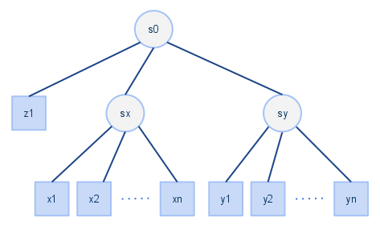

Main Features
=============

- *Standalone services*
    The supervisor is able to run default services like *httpd*,
    *mysql* which are invoked with a command of the type::
    
        $ service httpd start

- *Executable*
    The supervisor is able to run any executable program,
    not only standard services::
    
        /opt/whatever/instance/bin/service --option 1 --other "foo bar" --config /opt/whatever/instance/etc/whatever.cfg

- *Dead or "hang" state handling*
    Something important is to be able to handle services in an apparently
    running state but which are hanging. This should be handled from
    the service startup script.

- *OTP hierarchy of services*
    Inspired by OTP supervisor it support hierarchies of services.
    Services should be grouped together acting as a single service
    to the parent.

    A supervision tree is composed by supervisors and workers:

    - workers are identified by xN, yN and zN.
    - supervisors are identified by sX.

- *OTP strategies for handling services*
    Inspired by the OTP platform there are different strategies
    for handling group of services and their behavior.

- *Commands: start/stop/status/restart*
    Different commands can be specified to handle a service:
    
    - start
    - stop
    - status
    - restart (defaults to stop+start)

- *Ensure expected state*
    Each service should have an expected state.
    Possible states are:
    
    - running: expect the service to be running fine
    - stopped: the service should be disabled

- *Daemon mode*
    Supervisor is able to run in daemon mode continuously checking
    and applying the given configuration.

- *One shot mode*
    Supervisor can run in "one shot mode", which means it goes
    through the services handling and then exit. In order to handle the
    strategies correctly the state of the services is stored
    in order to be read during the next execution.

- *Root not required*
    Supervisor does not require to be run as *root* user, it is
    able to run as any user of course limited by the user privileges.

Copyright (C) 2013-2015 CERN
